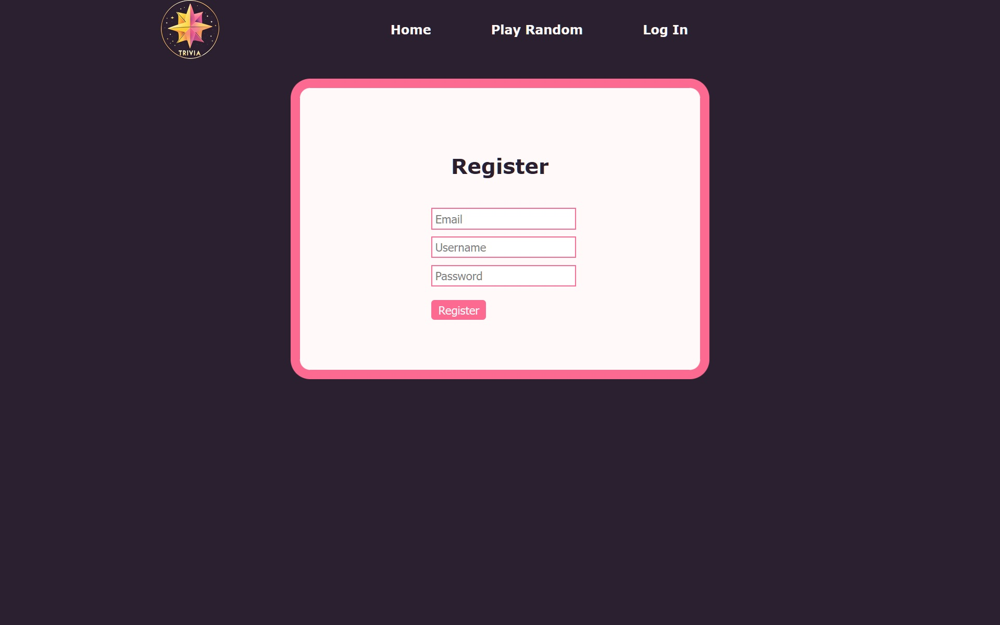
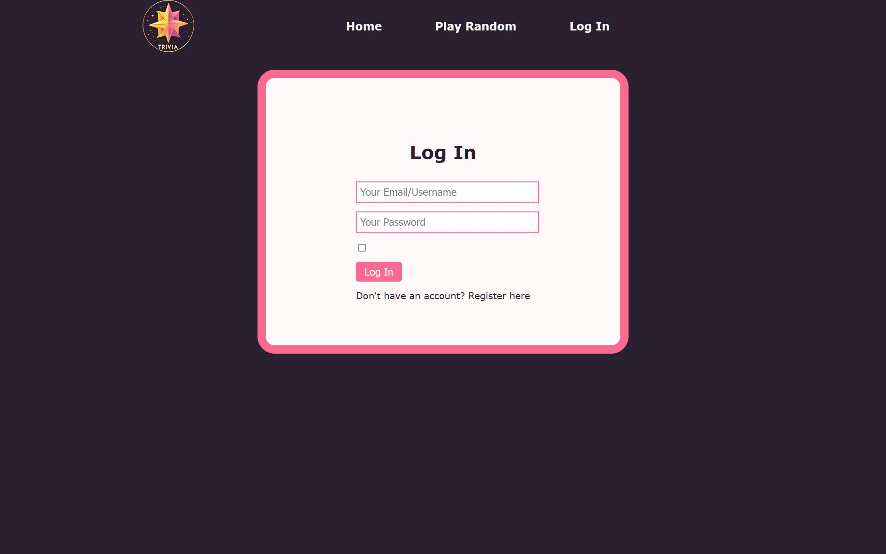
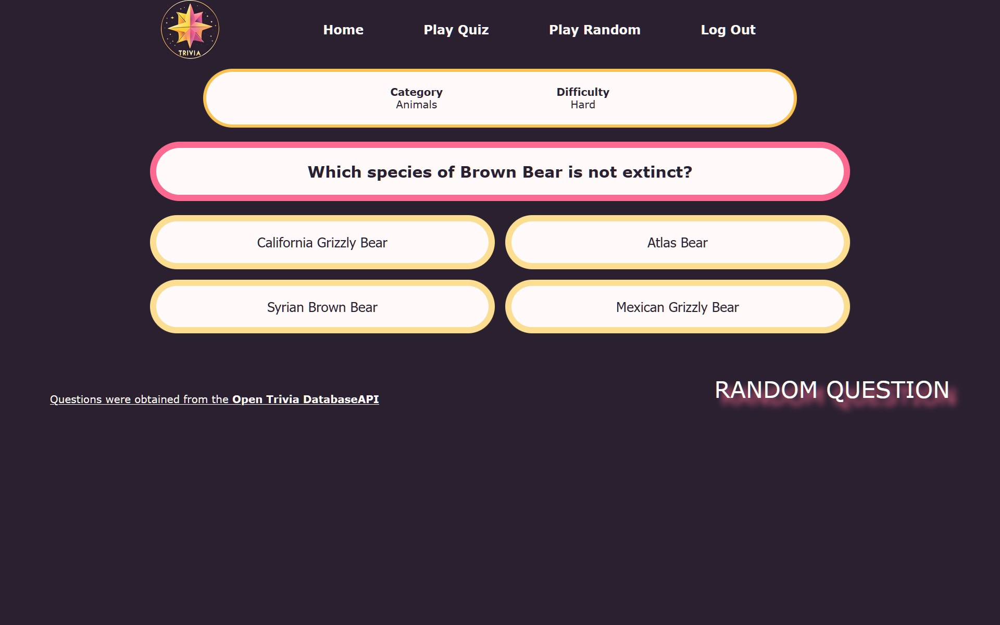
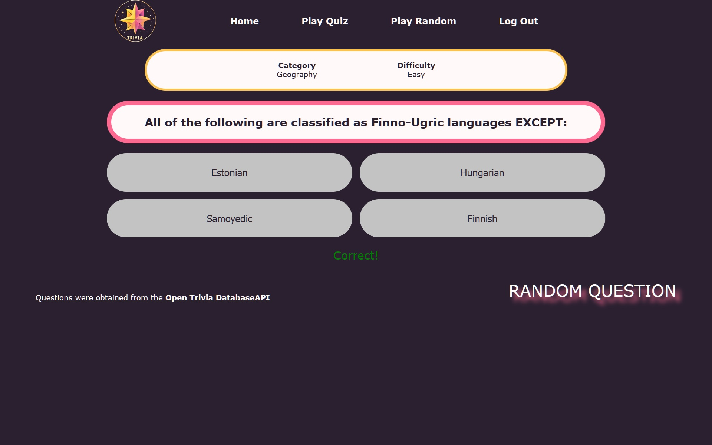
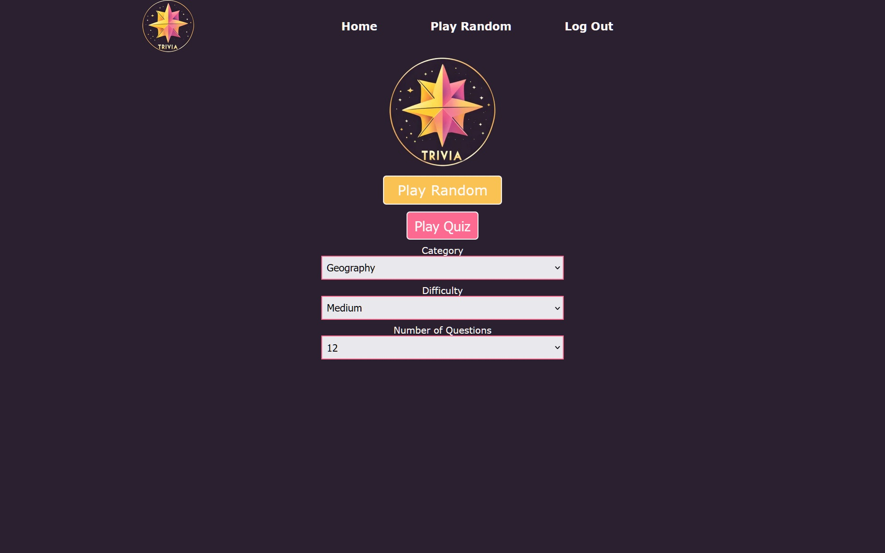
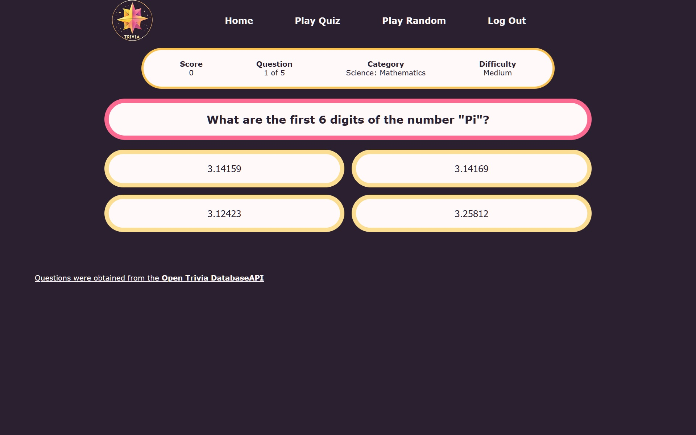
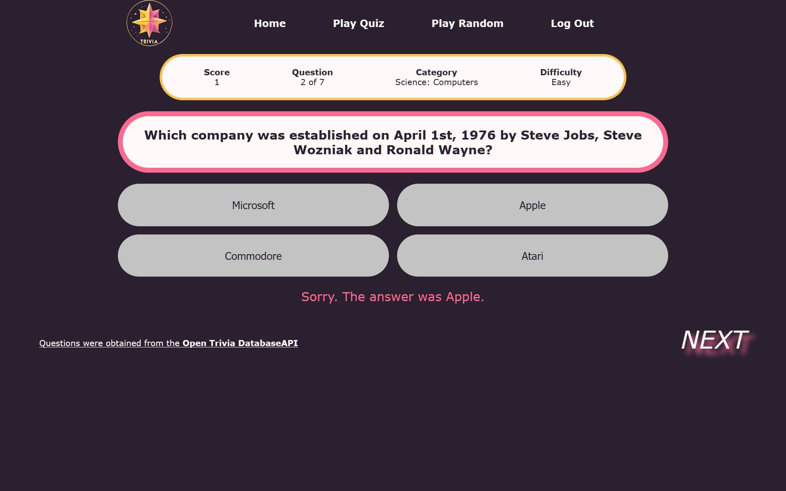
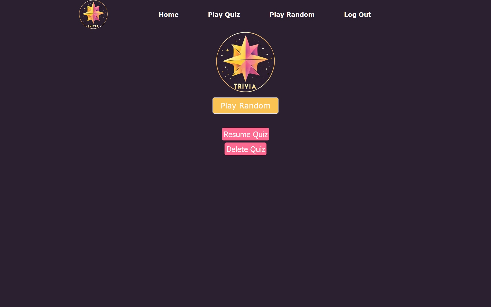

# Trivia Game

Welcome to Trivia Game! 🚀

This guide will detail the features of Trivia Game as well as explain how to register, log in and play both Random and Quiz modes.

> A user guide that explains how to clone this repository and take the required steps to run the application locally is located at [`docs/user_guide.md`](docs/user_guide.md).

Trivia Game can be played on a computer 💻 or mobile device 📱.

## Registering an Account

An account is needed to play the game. From the Log In page, click **Don't have an account? Register here**. You will be redirected to the **Registration** page to create an account.

_The Register page_

You will need to provide:

- a unique email
- a unique username
- a password with at least one **uppercase letter**, one **lowercase letter**, one **special character** (!@#$%^&\*), and that is at least **eight** characters long

## Logging In

If you have previously created an account, you can log in using your login credentials.

You can log in with either your email or username along with your password. After logging in, you will be redirected to the Homepage.

_The Log In page_

## Playing Random Mode

Click on the **Play Random** button in the navigation bar or on the Homepage to play a new question. From the Play Random page, there is also a **RANDOM QUESTION** button that does the same thing. Select this mode to get questions from all categories and difficulties. You can play endlessly!

In Random Mode, the scoreboard displays:

- the category of the question
- the difficulty of the current question

> **Note**: Scores are not tracked in random mode.

Answer a question by clicking an answer choice. After you answer a question, a message will appear. This message will either confirm that your answer was correct, or it will inform you that your answer was incorrect and provide the correct answer.

_An unanswered question in Random Mode_

_A correctly answered question in Random Mode_

## Playing Quiz Mode

Quizzes are specific sets of questions that can be played while keeping track of a score. Quizzes are unique to each user and a user can have one quiz at a time.

### Creating a New Quiz

To create a quiz, navigate to the Homepage by clicking **Home** in the navigation bar. If there is no saved quiz, there will be three dropdown menus to choose the parameters of the quiz:

1. **Category**: Choose the category of questions you want to answer. You can also choose "All" to get questions from every category.
2. **Difficulty**: Choose the difficulty level (easy, medium, or hard). You can also choose "All" to get questions from every difficulty.
3. **Number of Questions**: Choose the length of the quiz.

Click **Play Quiz** to start your Quiz!

_The Homepage when there is no saved Quiz_

In Quiz Mode, the scoreboard displays:

- your current score
- the current question number out of the total (ex: 3 out of 5)
- the category of the question
- the difficulty of the current question

Answer a question by clicking an answer choice. After you answer a question, a message will appear. This message will either confirm that your answer was correct, or it will inform you that your answer was incorrect and provide the correct answer. Click **NEXT QUESTION** to proceed.

_An unanswered question in Quiz Mode_

_An incorrectly answered question in Quiz Mode_

### Scoring

You earn points based on the difficulty of the questions:

- Easy: 1 point
- Medium: 2 points
- Hard: 3 points

### Resuming a Saved Quiz

You can leave the quiz at any time, and your progress will be saved.

If you have a saved Quiz, a **Play Quiz** button will show in the navigation bar and the Homepage will instead show a **Resume Quiz** button. Either of these buttons will allow you to return to your in-progress Quiz. The Homepage will also show **Delete Quiz** button which deletes your current Quiz and allows you to create a new one.

_The Homepage when there is a saved Quiz_

---

**Enjoy your Trivia adventure!** 🚀

> Questions in Trivia Game were obtained from the [Open Trivia Database API](https://opentdb.com/api_config.php)
